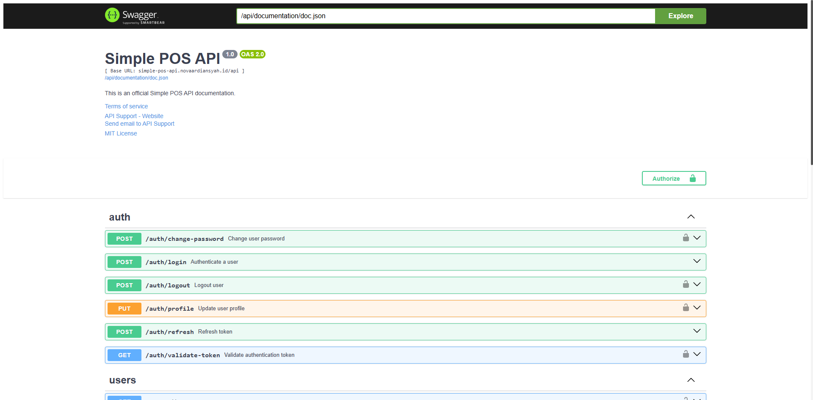

# Simple POS API

Hi Future Developer,

Welcome to the **Simple POS API**! This project is the backend service for the Simple POS Application, specifically designed for restaurants and eateries. It is built using **Golang** with the **Fiber** web framework, and it utilizes **GORM** for ORM and **PostgreSQL** as the database.

This repository provides a robust and scalable API for managing sales, inventory, and restaurant operations. It is designed to work seamlessly with the Next.js frontend.

## API Documentation

This project features comprehensive API documentation integrated with Swagger. You can explore and test the API endpoints here:
[https://simple-pos-api.novaardiansyah.id/api/documentation](https://simple-pos-api.novaardiansyah.id/api/documentation)

## Dazzling Tech Stack

- [Golang](https://go.dev/) - Programming Language
- [Fiber](https://gofiber.io/) - Web Framework
- [GORM](https://gorm.io/) - ORM for SQL
- [PostgreSQL](https://www.postgresql.org/) - Database
- [Swagger](https://swagger.io/) - API Documentation (swag)

## Related Project

- **Frontend Application (Next.js)**: [https://github.com/novaardiansyah/simple-pos](https://github.com/novaardiansyah/simple-pos)
- **Live Demo**: [https://simple-pos.novaardiansyah.id/](https://simple-pos.novaardiansyah.id/)

## Credentials & Environment

While this repository is public, please note that all forms of credentials, API keys (including `.env`), and environment configurations are **not provided for the public**. Access to the production database and sensitive configuration remains restricted for security reasons.

If you are interested in using this project for specific purposes or require a demo environment, please contact me directly for **exclusive permission**.

## Let's Connect

Need to chat? Feel free to drop me a line via [Email](mailto:novaardiansyah78@gmail.com) or hit me up on [WhatsApp](https://wa.me/6289506668480?text=Hi%20Nova,%20I%20have%20a%20question%20about%20your%20project%20on%20GitHub:%20https://github.com/novaardiansyah/simple-pos-api). I'm just a message away, ready to groove with you!

## Project Status

## Code of Conduct

We believe in fostering a welcoming and inclusive environment for everyone. Please be respectful, considerate, and constructive in all interactions. By participating in this project, you agree to uphold our [Code of Conduct](CODE_OF_CONDUCT.md). Let's collaborate and make this community awesome together!

## Licensing Groove

Exciting news! This project is grooving to the rhythm of the [MIT License](LICENSE).

Feel free to use, modify, and share it with the world. Just remember to keep the original license intact. Let's spread the joy of coding together!

---

**Happy coding and collaborating!**
— Nova Ardiansyah
